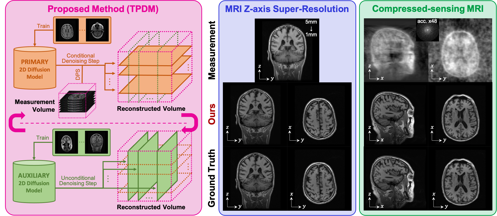

# Improving 3D Imaging with Pre-Trained Perpendicular 2D Diffusion Models (TPDM)

This repository `TPDM` is the official implementation of the paper [Improving 3D Imaging with Pre-Trained Perpendicular 2D Diffusion Models (arxiv)](https://arxiv.org/abs/2303.08440).




## Abstract
Proposed is a novel approach using two pre-trained 2D diffusion models perpendicular to each other to solve the 3D inverse problem effectively. Experimental results show its high effectiveness for 3D medical image reconstruction tasks, such as MRI Z-axis super-resolution, compressed sensing MRI, and sparse-view CT, generating high-quality voxel volumes for medical applications.


## Getting started


###  1. Clone the repository
```bash
git clone https://github.com/hyn2028/tpdm.git
cd tpdm
```


### 2. Install dependencies

Here's a summary of the key dependencies.
- python 3.10
- pytorch 1.13.1
- CUDA 11.7

We recommend using [conda](https://docs.conda.io/en/latest/) to install all of the dependencies.

```bash
conda env create -f environment.yaml
```
To activate the environment, run:

```bash
conda activate tpdm
```


### 3. Download the pre-trained checkpoints
Download the pre-trained model for a 256x256x256 brain-MRI volume from the Google Drive link below. You can find detailed information about the dataset which we used in the paper.

| Dataset | Resolution | Model | Slice| Plane | Link |
|:-------:|:----------:|:-----:|:----:|:-----:|:----:|
| BMR-ZSR-1mm | 256 | primary model | coronal | YZ | [link](https://drive.google.com/file/d/12Hmve4s0KsncXounyKh1zfsuaxsTSijZ/view?usp=drive_link) |
| | | auxiliary model | axial | XY | [link](https://drive.google.com/file/d/1rRi3ZIeYD8RxdWjgrtJIxytVRIlcz7ui/view?usp=sharing) |

After downloading the checkpoints, place them in the `./checkpoints` directory. The directory structure should look like this:
```
tpdm
├── checkpoints
│   ├── BMR_ZSR_256_XY
│   │   └── checkpoint.pth
│   └── BMR_ZSR_256_YZ
│       └── checkpoint.pth
│   ...
```


### 4. Download the sample brain-MRI volume (Generated by the pre-trained model)
Download the sample brain-MRI volume from the Google Drive [link](https://drive.google.com/file/d/1syz1X-sm2byH-r8X4xoEaGLLqMTSnVSR/view?usp=drive_link).

> NOTE: This samle volme is ***NOT A REAL MRI VOLUME***. The pre-trained generative model generated it.

Due to dataset restrictions, we are **unable to share the human subject test volumes** we used in our experiments, so we provide a volume generated by unconditional `TPDM` as a sample. 

After downloading the sample volume, place it in the `./dataset_sample` directory. The directory structure should look like this:
```
tpdm
├── dataset_sample
│   └── BMR_256_synthetic_0
│       ├── 000.npy
│       ├── 000.png
│       ├── 001.npy
│       ├── 001.png
│       ...
│       ├── 255.npy
│       └── 255.png
│   ...
```


### 5. Run `TPDM`

> NOTE: The ***RESULT*** using this sample volume may be ***MUCH HIGHER*** than the reported .

Note that the paper evaluated using real human subject MRI volumes, so reconstructions using the sample volumes provided may result in much higher results than those reported in the paper.

You can see the various arguments for all executables as shown below. There are many more arguments than the ones shown in the example. 

```bash
python run_tpdm_uncond.py --help
python run_tpdm_mrzsr.py --help
python run_tpdm_csmri.py --help
python run_tpdm_svct.py --help
```

Please don't rely on automatic DPS weights, as the optimal DPS weight can vary depending on the type of problem, parameters of the problem, measurements, and batch size. This is for reference only.

#### 5.1. Unconditional volume generation
To generate a 256x256x256 brain-MRI volume with `TPDM`, run the following command:
```bash
python run_tpdm_uncond.py --batch-size <batch-size>
```


#### 5.2. MRI Z-axis super-resolution (MR-ZSR)
To perform MR-ZSR on a sample volume with `TPDM`, run the following command:
```bash
python run_tpdm_mrzsr.py ./dataset_sample/BMR_256_synthetic_0 --batch-size <batch-size>
```
Additional arguments allow you to adjust the super-resolution factor and DPS weight.


#### 5.3. Compressed sensing MRI (CS-MRI)
To perform CS-MRI on a sample volume with `TPDM`, run the following command:
```bash
python run_tpdm_csmri.py ./dataset_sample/BMR_256_synthetic_0 --batch-size <batch-size>
```
Additional arguments allow you to adjust the acceleration factor and DPS weight.


#### 5.4. Sparse-view CT (SV-CT)
To perform SV-CT on a sample volume with `TPDM`, run the following command:
```bash
python run_tpdm_svct.py ./dataset_sample/BMR_256_synthetic_0 <dps-weight> --batch-size <batch-size>
```
We do not provide automatic DPS weights for SV-CT. Enter the desired positive real number at `<dps-weight>`. Additional arguments allow you to adjust the sparsity for sparse-view CT.


## Traning your own model
Our models were trained independently of the TPDM sampling procedure using [score-SDE](https://arxiv.org/abs/2011.13456). Use the [repository](https://github.com/yang-song/score_sde) to train the two perpendicular diffusion models. Please refer to that repository for usage of that training code.

> NOTE: `TPDM`'s sampling code is only implemented for variance-exploding SDE (VE-SDE).

See the `./configs/default_lsun_configs.py` and `./configs/ve/BMR_ZSR_256.py` for the configurations we used to train `score-SDE` model. 


## Acknowledgements
This code is based on [score-SDE](https://arxiv.org/abs/2011.13456) and its official [implementation](https://github.com/yang-song/score_sde). We thank the authors for their work and for sharing the code.


## Citation
If you find this repository useful in your research, please cite our paper:

```
@InProceedings{lee2023improving,
    title={Improving 3D Imaging with Pre-Trained Perpendicular 2D Diffusion Models},
    author={Lee, Suhyeon and Chung, Hyungjin and Park, Minyoung and Park, Jonghyuk and Ryu, Wi-Sun and Ye, Jong Chul}
    booktitle={Proceedings of the IEEE/CVF International Conference on Computer Vision (ICCV)},
    month={October},
    year={2023}
}
```
